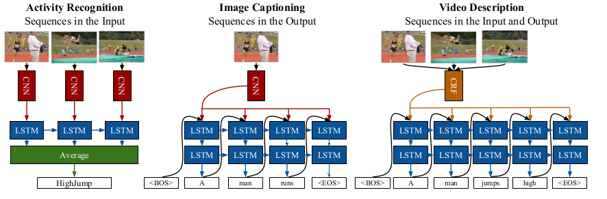
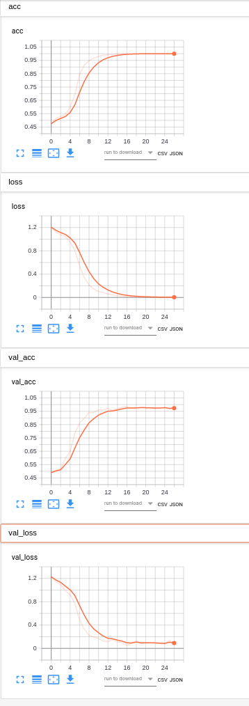
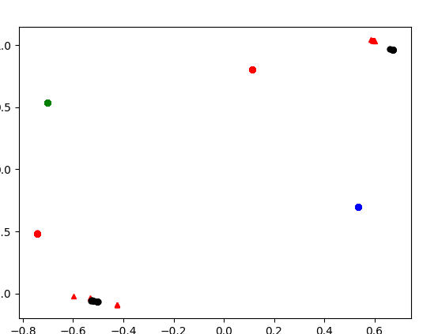

# Requirement 
- Keras
- Tensorflow 1.14 (for using CuDNNLSTM)
- CUDA 10.0
- FFmpeg

# Method
- LRCN




# Code Hierarchy
```
root
├── dataset                   
│   ├── annotated_video                           : annotated short videos 
│   ├──   ├── batch_name
│   ├──   ├──    ├── example.mp4
│   ├──   ├──    ├──  ...
│   ├──   ├── ...
│   ├── annotated_video_script                    : one-to-one relationship with video/batch_name
│   ├──   ├── batch_name.json   
│   ├──   ├── ...
│   ├── extracted_image                           : one-to-one relationship with video/batch_name/example      
│   ├──   ├── batch_name
│   ├──   ├──    ├── example
│   ├──   ├──    ├──    ├── 0001.png
│   ├──   ├──    ├──    ├── ...
│   ├──   ├──    ├──  ...
│   ├──   ├── ... 
│   ├── extracted_sequence                        : one-to-one relationship with video/batch_name/example.mp4      
│   ├──   ├── batch_name
│   ├──   ├──    ├── example.npy
│   ├──   ├──    ├──  ...
│   ├──   ├── ...
│   ├── script
│   ├──   ├── merged_videos.json                  : result of merge all manual annotation video
│   ├──   ├── extracted_seq_raw.json              : result of sequence list
│   ├──   ├── extracted_seq_split.json            : result of sequence train map
├── output                   
│   ├── checkpoint                                : trained model
│   ├── logs                                      : trained logs
├── src                                           : source code
│   ├── annotation_tool                           : split long video to short and merge annotation json files
│   ├── network                                   : lrcn and other AI network
│   ├── stash                                     : legacy code
│   ├── tools                                     : assist tool
│   ├── data.py                                   : data generator
│   ├── predict.py                                : predict script
│   ├── preprocess.py                             : 1. extract frams from video 2. gen image or feature sequence 3. gen train,valid,test dataset 
│   ├── test_network.py                           : test script
│   ├── train.py                                  : train script
```

- Generate Code Hierarchy
```
cd src
python utils.py
```


## Split Long Video
Run split_long_video.py , split origin video to short videos and gen related json file batch_name.json .

```
video_path : some_dir/batch_name/video.mp4
```
```
some_dir
├── batch_name                   
│   ├── 00000.mp4             
│   ├── 00001.mp4            
│   ├── ...           
│   ├── batch_name.json
```
Annotation videos manual and update batch_name.json  
- Copy short videos to ./dataset/annotated_video/batch_name
- Copy batch_name.json to ./dataset/annotated_video_script

## Merge Annotation Files
Run ./src/annotation/merge_annotation_video, Merge all batch video files to ./dataset/script/merged_video.json

## Extract Frames From Short Videos
Extract frames to ./dataset/extracted_image

## Build Sequence 
Two type sequence can be generated. it's depend on SEQ_DATA_TYPE. Generate sequence to ./dataset/extracted_sequence
- Origin Image. For end to end train. just like LRCN 
- CNN Feature. For LSTM

## Split Data To Train,Valid,Test
Generate Train Map to ./dataset/script/extracted_seq_split.json

## Train
You can try to train model by run this command.
```
python ./src/train.py
```
If you want to change any parameter, you can find it in train.py file

# Performance 
- Best LRCN Model
```
    def create_model_pretrain(self, lstm_unit==64):
        model = Sequential()
        model.add(
            TimeDistributed(
                input_shape=self.input_shape  # 5 images...
            )
        )
        model.add(
            TimeDistributed(
                GlobalAveragePooling2D()  # Or Flatten()
            )
        )
        model.add(
            CuDNNLSTM(lstm_unit, return_sequences=False)
        )
        model.add(Dense(64, activation='relu'))
        model.add(Dropout(.5))
        model.add(Dense(24, activation='relu'))
        model.add(Dropout(.5))
        model.add(Dense(self.nb_classes, activation='softmax'))
        model.summary()                MobileNetV2(weights='imagenet', include_top=False),
                input_shape=self.input_shape  # 5 images...
            )
        )
        model.add(
            TimeDistributed(
                GlobalAveragePooling2D()  # Or Flatten()
            )
        )
        model.add(
            CuDNNLSTM(lstm_unit, return_sequences=False)
        )
        model.add(Dense(64, activation='relu'))
        model.add(Dropout(.5))
        model.add(Dense(24, activation='relu'))
        model.add(Dropout(.5))
        model.add(Dense(self.nb_classes, activation='softmax'))
        model.summary()
```

- Train Curve 



- Cluster




# Tool
- KNN and MDS 
- Optical Flow

# Acknowledgement
- Author : Zou jili 
- Email : jili.zou1@hp.com

# Reference
## Paper
- Two-Stream Convolutional Networks for Action Recognition in Videos. Karen Simonyan, Andrew Zisserman
- A Discriminative CNN Video Representation for Event Detection. Zhongwen Xu,  Yi Yang 
- Large-scale Video Classification with Convolutional Neural Networks. Andrej Karpathy
- A Discriminative CNN Video Representation for Event Detection
- Beyond Short Snippets: Deep Networks for Video Classification. Joe Yue-Hei Ng
- Exploiting Image-trained CNN Architectures for Unconstrained Video Classification. Shengxin Zha
- Long-term Recurrent Convolutional Networks for Visual Recognition and Description. Jeff Donahue, Lisa Anne Hendricks
- Unsupervised Learning of Video Representations using LSTMs. Nitish Srivastava
## Code
- https://github.com/peachman05/action-recognition-tutorial
- https://github.com/udacity/self-driving-car/blob/master/