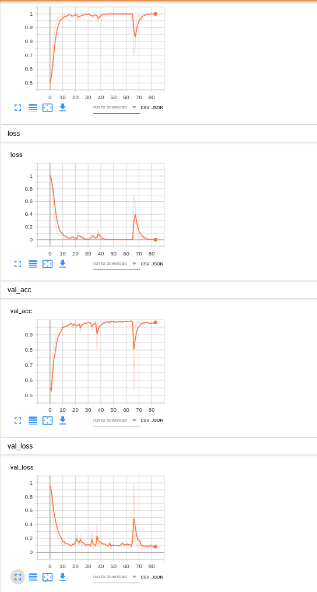
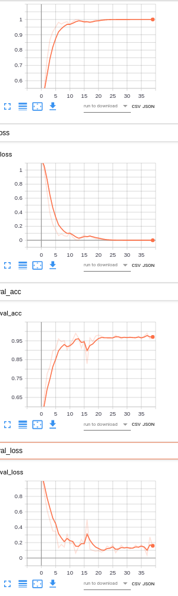
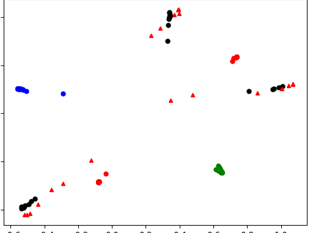
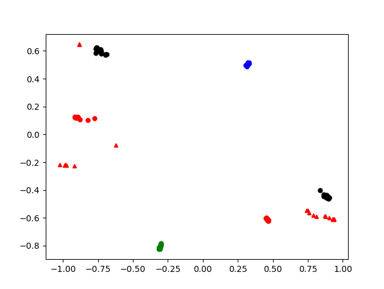

# LRCN
- Model
```
    def create_model_pretrain(self, lstm_unit==64):
        model = Sequential()
        model.add(
            TimeDistributed(
                MobileNetV2(weights='imagenet', include_top=False),
                input_shape=self.input_shape  # 5 images...
            )
        )
        model.add(
            TimeDistributed(
                GlobalAveragePooling2D()  # Or Flatten()
            )
        )
        model.add(
            CuDNNLSTM(lstm_unit, return_sequences=False)
        )
        model.add(Dense(64, activation='relu'))
        model.add(Dropout(.5))
        model.add(Dense(24, activation='relu'))
        model.add(Dropout(.5))
        model.add(Dense(self.nb_classes, activation='softmax'))
        model.summary()
```

- Optimizer
```
        optimizer = Adam(lr=1e-4, decay=1e-5)
```


| CNN Network | CNN Feature |CNN Pre-trained | CNN Frezze | LSTM Hidden Unit | LSTM Dropout| LSTM Regularizer| Category | Train Accurate |Train Lost |Validate Accurate | Validate Lost | Test Accurate |Best Train Time Cost | Best Model Step | OverFit | Label |
| --- | --- |  --- |  --- |  --- |  --- |  --- |  --- |  --- |  --- |   --- |   --- | --- | --- | --- | --- | --- | 
| MobileNetV2 | block_16_project_BN (1280) | Yes | None | 64 | 0.5 | None| 3 |0.9993  |0.01| 0.9916 | 0.1089 | | 48min |64| No | B3 |
| MobileNetV2 | block_16_project_BN (1280) | Yes | None | 64 | 0.5 | None| 5 |0.9993  |0.01| 0.9755 | 0.1273 | 0.9872 |19min |29| No | B5_lstm_64 |
| MobileNetV2 | block_16_project_BN (1280) | Yes | None | 256 | 0.5 | None| 5 |1  |0.0001| 0.9881 | 0.09 | 0.96875 |17min | 22 | No | B5_lstm_256 |
| MobileNet   |global_max_pooling2d_1(1024)| Yes | None | 256 | 0.5 | None| 5 | 0.9799 | 0.06 | 0.9657 | 0.2067 | 0.98 | 30min | 45 |No  |  |
| VGG19       | block5_pool (512)          | Yes | None | 256 | 0.5 | None| 5 | 1 | 0.0026| 0.9853| 0.05 | 0.9935 | 21min | 16 |No  | vgg-19_lr_1e-5 |
| ResNet152V2 | 2048                       | Can't work well in diff learning rate 
 


# Label B3 
## NetWork
```
Layer (type)                 Output Shape              Param #   
=================================================================
time_distributed_1 (TimeDist (None, 7, 7, 7, 1280)     2257984   
_________________________________________________________________
time_distributed_2 (TimeDist (None, 7, 1280)           0         
_________________________________________________________________
cu_dnnlstm_1 (CuDNNLSTM)     (None, 64)                344576    
_________________________________________________________________
dense_1 (Dense)              (None, 64)                4160      
_________________________________________________________________
dropout_1 (Dropout)          (None, 64)                0         
_________________________________________________________________
dense_2 (Dense)              (None, 24)                1560      
_________________________________________________________________
dropout_2 (Dropout)          (None, 24)                0         
_________________________________________________________________
dense_3 (Dense)              (None, 5)                 125       
=================================================================
Total params: 2,608,405
Trainable params: 2,574,293
Non-trainable params: 34,112

```

## Board 



# Label B5 

- NetWork
```
Model: "sequential_1"
_________________________________________________________________
Layer (type)                 Output Shape              Param #   
=================================================================
time_distributed_1 (TimeDist (None, 7, 7, 7, 1280)     2257984   
_________________________________________________________________
time_distributed_2 (TimeDist (None, 7, 1280)           0         
_________________________________________________________________
cu_dnnlstm_1 (CuDNNLSTM)     (None, lstm_unit)         1574912   
_________________________________________________________________
dense_1 (Dense)              (None, 64)                16448     
_________________________________________________________________
dropout_1 (Dropout)          (None, 64)                0         
_________________________________________________________________
dense_2 (Dense)              (None, 32)                2080      
_________________________________________________________________
dropout_2 (Dropout)          (None, 32)                0         
_________________________________________________________________
dense_3 (Dense)              (None, 5)                 165       
=================================================================
Total params: 3,851,589
Trainable params: 3,817,477
Non-trainable params: 34,112
```
## Broad



## Cluster
```
['or', 'ob', 'og', 'ok', '^r']
["chop", "others", "gun", "chests", "shooting"]
```

- B5_lstm_64



- B5_lstm_256


# VGG-19

- optimizer = Adam(lr=1e-4, decay=1e-5) , network not work well in long time 
- optimizer = Adam(lr=1e-5, decay=1e-6) , network can work

## Board 


## Cluster 




# Customer 
## Model
```
        model = Sequential()
        # after having Conv2D...
        model.add(
            TimeDistributed(
                Conv2D(64, (3, 3), activation='relu'),
                input_shape=self.input_shape  # 5 images...
            )
        )
        model.add(
            TimeDistributed(
                MaxPooling2D(pool_size=(2, 2), strides=(2, 2))  # Or Flatten()
            )
        )
        ###
        model.add(
            TimeDistributed(
                Conv2D(64, (3, 3), activation='relu')
            )
        )
        # We need to have only one dimension per output
        # to insert them to the LSTM layer - Flatten or use Pooling
        model.add(
            TimeDistributed(
                GlobalAveragePooling2D()  # Or Flatten()
            )
        )
        # previous layer gives 5 outputs, Keras will make the job
        # to configure LSTM inputs shape (5, ...)
        model.add(
            CuDNNLSTM(256, return_sequences=False)
        )
        # and then, common Dense layers... Dropout...
        # up to you
        model.add(Dense(256, activation='relu'))
        model.add(Dropout(.5))

        model.add(Dense(64, activation='relu'))
        model.add(Dropout(.5))
        # For example, for 3 outputs classes
        model.add(Dense(self.nb_classes, activation='softmax'))
```
## Network

```
Layer (type)                 Output Shape              Param #   
=================================================================
time_distributed_1 (TimeDist (None, 7, 222, 222, 64)   1792      
_________________________________________________________________
time_distributed_2 (TimeDist (None, 7, 111, 111, 64)   0         
_________________________________________________________________
time_distributed_3 (TimeDist (None, 7, 109, 109, 64)   36928     
_________________________________________________________________
time_distributed_4 (TimeDist (None, 7, 64)             0         
_________________________________________________________________
cu_dnnlstm_1 (CuDNNLSTM)     (None, 256)               329728    
_________________________________________________________________
dense_1 (Dense)              (None, 256)               65792     
_________________________________________________________________
dropout_1 (Dropout)          (None, 256)               0         
_________________________________________________________________
dense_2 (Dense)              (None, 64)                16448     
_________________________________________________________________
dropout_2 (Dropout)          (None, 64)                0         
_________________________________________________________________
dense_3 (Dense)              (None, 5)                 325       
=================================================================
```


